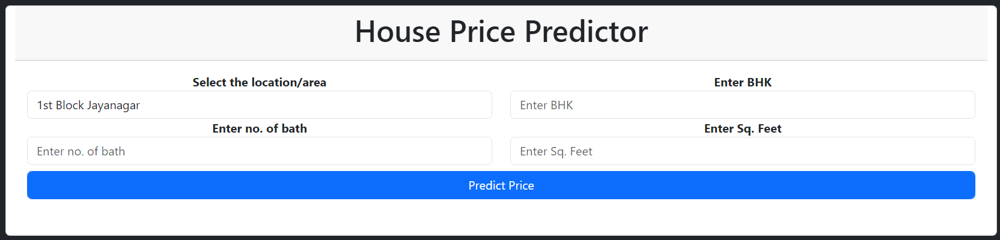

## HOUSE PRICE PREDICTOR

Run the main.py file, and it will automatically open the web app in your browser.

This is how the app looks: 

## Bengaluru House Price Prediction

### Dataset Source
The dataset used in this project was obtained from Kaggle. You can find it [here](https://www.kaggle.com/datasets/amitabhajoy/bengaluru-house-price-data).

### Overview
This application predicts the price of a home in Bengaluru based on factors such as location, the number of bathrooms, bedrooms (BHK), and size.

### Project Description
This project is a regression model that I developed to showcase my skills in machine learning.

-- Technologies Used
- Flask: A micro web framework used for creating the web application.
- Bootstrap: Utilized for styling buttons within the web application.
- HTML: The index.html file was crafted using HTML to structure the web content.

### Usage
Download whole folder and run the main.py file, and it will automatically open the web app in your browser.

### Acknowledgments
Thanks to Kaggle for the dataset.
